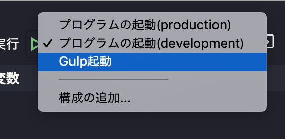

# プロジェクトの骨格を作る際のメモ

## 環境変数

### 定義済みの環境変数  

|変数名|説明|
|---|---|
|`NODE_PATH`|Node実行時にモジュールを検索するパスをセミコロン区切りで指定。|

### 慣例的に使われる環境変数  
|変数名|説明|
|---|---|
|`NODE_ENV`| productionまたはdevelopmentを指定。Nodeの実行環境を定義。|
|`NODE_DEBUG`| デバッグ出力したいモジュール名をカンマ区切りで指定。|

#### 使い方
- ソース中で利用する方法
```js
console.log(process.env.NODE_ENV);
```

- 実行時に使用する方法(ターミナルなど)
```sh
set NODE_ENV=development && node ./index.js
```

## デバッグ構成の準備

以下のように記述するとVScodeのデバッグ構成が作れる。
```json
"configurations": [
  {
    "type": "node",
    "request": "launch",
    "name": "プログラムの起動(production)",
    "skipFiles": [
      "<node_internals>/**"
    ],
    "program": "${workspaceFolder}/app.js",
    "env": {
      "NODE_ENV": "production"
    },
  },
  {
    "type": "node",
    "request": "launch",
    "name": "プログラムの起動(development)",
    "skipFiles": [
      "<node_internals>/**"
    ],
    "program": "${workspaceFolder}/app.js",
    "env": {
      "NODE_ENV": "development"
    },
  },
  {
    "type": "node",
    "request": "launch",
    "name": "Gulp起動",
    "program": "${workspaceFolder}/node_modules/gulp/bin/gulp.js",
    "args": [
      "task"
    ],
    "skipFiles": [
      "<node_internals>/**"
    ]
  },
```

```js
console.log(process.env.NODE_ENV); // それぞれの環境変数が表示される。
```

## ESLint
JavaScriptの静的解析ツール。
- pluggable (ルールをPJ別に指定できる。)

### 使い方
1. Install Vscode plugin.
1. Install eslint in your project.
1. Create rule file.
```sh
# Run Wizard
./node_module/.bin/eslint --init
```

### ルールファイルの基本
https://eslint.org/docs/rules/
```js
rules: {
  name: [level, options]
}
```